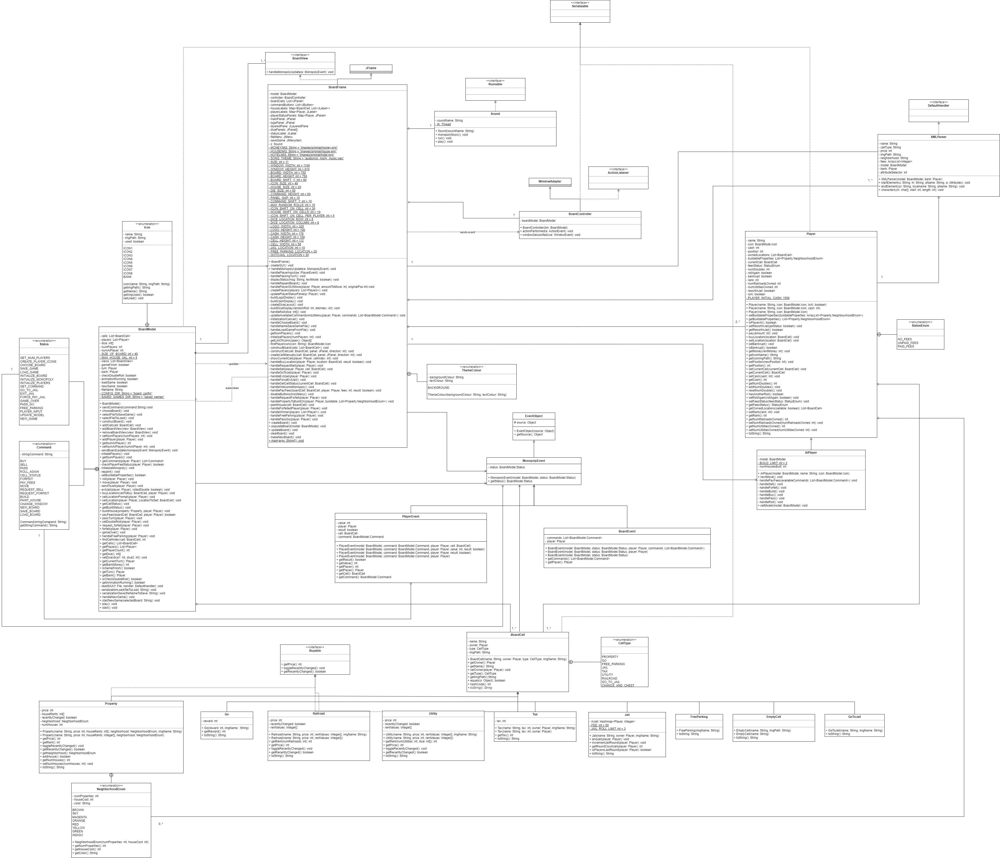

# Monopoly Simulator

<p align="center">

</p>

## Description
This repository simulates the popular board game monopoly. In this interactive business game you will try to outwit your
opponents by making them go bankrupt while purchasing properties
around the board. Spend wisely and aim for a TOTAL MONOPOLY. 

<p align="center">

</p>

## Authors
[@Bardia Parmoun](https://github.com/bardia-p) \
[@Kyra Lothrop](https://github.com/kyralothrop) \
[@Sarah Chow](https://github.com/sarahchoww) \
[@Owen VanDusen](https://github.com/OwenVanDusen1)

## Compiling the Program
To compile the program simply load the 'build.xml' file to ant and select the main tag.

Alternatively you can use:
```
ant -buildfile build.xml
```

## Running the Program
- To run the program, simply click on the jar file created by the 'build.xml' file to run it.\
Alternatively you can use: 
    ```
    java -jar Monopoly.jar
    ```
- Once the program is loaded select: ```File -> New Board```
- From there you can choose your desired board config to load.
- You can also load any of your previous saved games using: ```File -> Load Board```

For a detailed explanation of how to run the program please refer to the [user manual](https://github.com/bardia-p/Monopoly-Simulator/blob/master/documents/UserManual.pdf).

## Making Custom Boards
You can customize the board however you want!

Make sure you follow the .xml templates under the [board_config](https://github.com/bardia-p/Monopoly-Simulator/tree/master/board_config) folder. Once you have created your xml file, it will appear under the drop down menu upon reloading the game. 

You have the option of adding images to each cell:
1. If you choose to add images to the cell:
    - Create a directory for your new config under the src directory to include your images.
    - Make sure to add the proper ```<image></image>``` tag with the proper relative path for each path.
    - You can look at [rick_and_morty_images_config](https://github.com/bardia-p/Monopoly-Simulator/blob/master/board_config/rick_morty_board_images.xml) as an example.
    <p align="center">
        
    </p>
2. If you choose not to include any images, the program will generate the invidual cells based on the information that you have provided.
    - You can look at [rick_and_morty_config](https://github.com/bardia-p/Monopoly-Simulator/blob/master/board_config/rick_morty_board.xml) as an example. 
    <p align="center">
        
    </p>

## Monopoly Design Process
This project is developed by implementing the [MVC design pattern](https://www.geeksforgeeks.org/mvc-design-pattern/). 

- Here is the UML diagram of the project:
<p align="center">
    
</p>

- You can also learn more about the logic behind each command through their related sequence diagrams located [here](https://github.com/bardia-p/Monopoly-Simulator/tree/master/diagrams/sequence_diagrams).
- The summary of the design decisions of this project can also be found [here](https://github.com/bardia-p/Monopoly-Simulator/blob/master/documents/DesignDecisions.pdf).
  
## Roadmap Ahead
- Adding more customizatin to the board setup for the player icons and background colours.

## CREDITS
Authors: Bardia Parmoun, Kyra Lothrop, Sarah Chow, and Owen VanDusen

Copyright © 2021. All rights reserved
